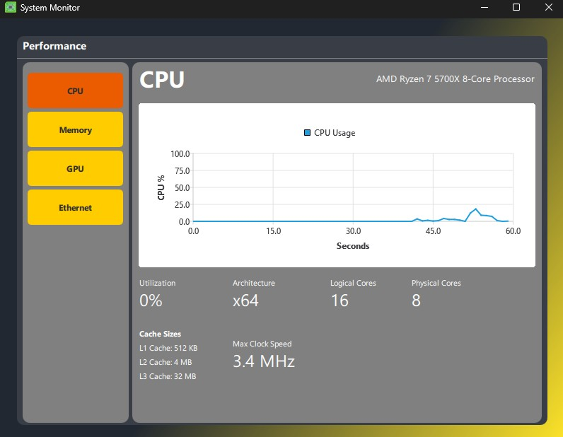
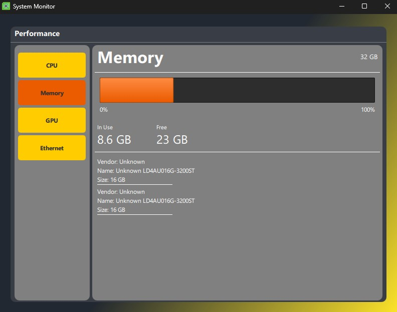
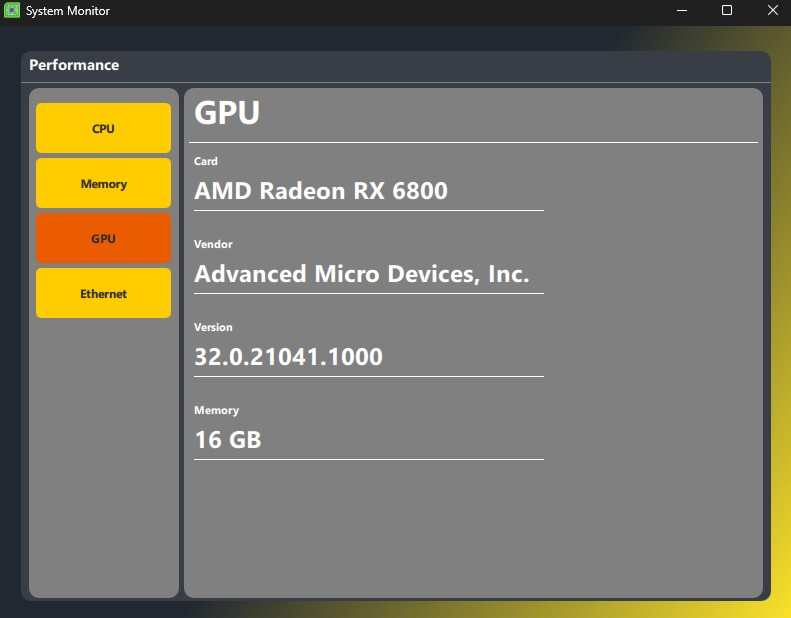
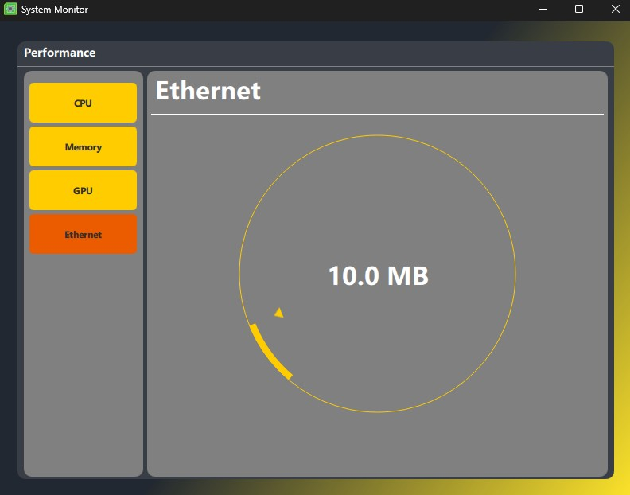

# System Info Monitor
Made using Qt framework and C++. uses HWINFO to get hardward information about your system and display it.

## Features
Three templated buttons on sidebar, which control the widget stack to display different Information about your usage in regards with CPU, Memory And Download.
- Qt Charts for CPU usage over last 60 seconds
- Progress bar for Memory Usage
- Non-Editable Dial for Download Speed display.

    
    
    
    

## Built With
- **Language**: C++, QML
- **Build System**: [CMake](https://cmake.org)
- **Third Party**: Qt-Framework, [HWINFO](https://github.com/lfreist/hwinfo)
- **Platform**: Windows
